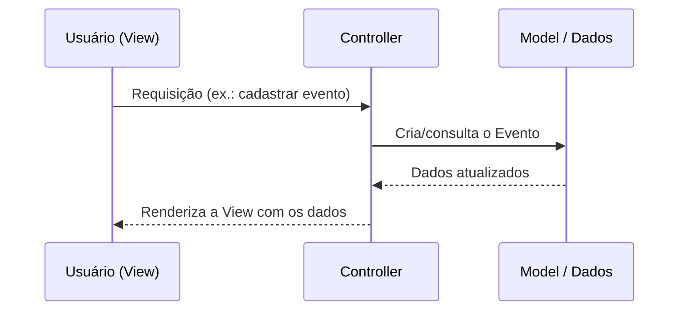
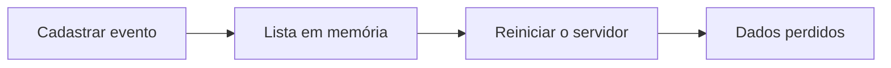

> **APOSTILA DE APOIO À AULA**
**Arquitetura MVC: Separação de Responsabilidades**
Desenvolvimento Web II — DSM — 2º semestre
Professor: Vagner dos Santos
Aula 4 — 27/08/2026

| **Propósito do material** Nas aulas anteriores construímos um servidor com rotas e demos rigor ao ambiente. Agora vamos organizar o **código**. Esta apostila apresenta o padrão arquitetural **MVC** (Model-View-Controller): por que separar responsabilidades, o que cabe a cada camada e como refatorar uma aplicação monolítica para uma estrutura organizada. Veremos também um limite importante — organizar não é o mesmo que persistir. Como sempre, Python e Flask são apoio; o princípio de separação vale para qualquer linguagem. |
| --- |

# 1. Objetivos de aprendizagem

Ao concluir esta aula e o estudo deste material, você deverá ser capaz de:

- Explicar o problema de concentrar toda a lógica em um único arquivo (**monólito**).
- Descrever as responsabilidades de **Model**, **View** e **Controller**.
- Rastrear o **fluxo de uma requisição** em uma aplicação MVC.
- Refatorar uma aplicação simples de **monolítica para MVC**.
- Utilizar **Blueprints** para modularizar rotas por domínio.
- Reconhecer que a **organização em camadas não garante persistência**.

# 2. Introdução: o arquivo que faz tudo

Até aqui, o nosso `app.py` concentrava tudo: as rotas, a lógica de cada rota e o conteúdo devolvido. Isso funciona enquanto o projeto é minúsculo. Mas imagine dezenas de rotas, regras de negócio e páginas dentro de um único arquivo: ele se torna difícil de ler, de testar e de manter — e, em uma dupla, difícil de trabalhar sem conflitos.

A resposta da engenharia de software para esse problema é antiga e poderosa: **separar responsabilidades**. Em vez de um arquivo que faz tudo, teremos partes especializadas, cada uma com um papel claro. O padrão que organiza essa separação em aplicações interativas é o **MVC**.

**Referência conceitual:** A separação de responsabilidades é um princípio central de arquitetura de software (Sommerville, 2019). O padrão MVC foi formalizado por Krasner e Pope (1988) e é discutido, no contexto de aplicações corporativas, por Fowler (2002).

# 3. O padrão MVC

**MVC** significa **Model-View-Controller**. Ele divide a aplicação em três responsabilidades:

| Camada | Responsabilidade | No nosso projeto |
| --- | --- | --- |
| Model | Representa as entidades e os conceitos do domínio. | A entidade **Evento** (nome, data, local). |
| View | Apresenta os dados e coleta as interações do usuário. | A página que lista e cadastra eventos. |
| Controller | Recebe a requisição e coordena o fluxo. | A rota que trata o cadastro e a listagem. |

| **Ideia-chave** O Controller **coordena**, mas não deve concentrar toda a lógica; o Model **representa** o domínio; a View **apresenta**. Cada camada tem um motivo único para mudar. |
| --- |

# 4. O fluxo de uma requisição no MVC

Quando o usuário interage com a aplicação, a requisição percorre as camadas em uma ordem previsível:



O Controller é o **maestro**: recebe o pedido, aciona o Model (ou a fonte de dados) e escolhe qual View apresentar. Ele coordena, mas delega.

# 5. Situação-problema da aula

> O `app.py` do projeto de eventos cresceu: a mesma função recebe o formulário, cria o evento, guarda-o e ainda monta a página. Ao trabalhar em dupla, os dois integrantes mexem no mesmo arquivo e surgem conflitos no Git. Como **organizar** esse código para que cada parte tenha um lugar próprio?

A pergunta central é: **como separar o que hoje está tudo junto?** A resposta é refatorar o projeto para MVC — sem mudar o que a aplicação faz, apenas **onde** cada coisa mora.

# 6. Refatoração guiada: de monolítico para MVC

## 6.1 Antes — monolítico

Uma única função concentra tudo:

```python
# app.py (monolítico)
from flask import Flask, render_template, request, redirect

app = Flask(__name__)
eventos = []

@app.route("/", methods=["GET", "POST"])
def index():
    if request.method == "POST":
        eventos.append({
            "nome": request.form["nome"],
            "data": request.form["data"],
            "local": request.form["local"],
        })
        return redirect("/")
    return render_template("index.html", eventos=eventos)
```

## 6.2 Depois — organizado em camadas

A mesma funcionalidade, distribuída por responsabilidade:

```
projeto_eventos/
├── app.py
├── controllers/
│   └── evento_controller.py
├── models/
│   └── evento.py
├── data/
│   └── memoria.py
└── templates/
    └── index.html
```

**Model** — representa a entidade do domínio:

```python
# models/evento.py
class Evento:
    def __init__(self, nome, data, local):
        self.nome = nome
        self.data = data
        self.local = local
```

| **Nota** A palavra `class` faz parte de **orientação a objetos**, que você aprofunda em TP1. Por ora, entenda a classe `Evento` como o **molde** que representa um evento, com seus dados. |
| --- |

**Fonte de dados** — o "depósito" em memória (por enquanto):

```python
# data/memoria.py
eventos = []
```

**Controller** — coordena a requisição:

```python
# controllers/evento_controller.py
from flask import Blueprint, render_template, request, redirect
from models.evento import Evento
from data.memoria import eventos

evento_bp = Blueprint("evento", __name__)

@evento_bp.route("/", methods=["GET", "POST"])
def index():
    if request.method == "POST":
        evento = Evento(
            request.form["nome"],
            request.form["data"],
            request.form["local"],
        )
        eventos.append(evento)
        return redirect("/")
    return render_template("index.html", eventos=eventos)
```

**View** — apresenta os dados e coleta o formulário:

```html
<!-- templates/index.html -->
<!doctype html>
<html lang="pt-br">
  <head><meta charset="utf-8"><title>Eventos</title></head>
  <body>
    <h1>Eventos Acadêmicos</h1>
    <form method="post">
      <input name="nome" placeholder="Nome" required>
      <input name="data" placeholder="Data" required>
      <input name="local" placeholder="Local" required>
      <button type="submit">Cadastrar</button>
    </form>
    <ul>
      
        <li>{{ e.nome }} — {{ e.data }} — {{ e.local }}</li>
      
    </ul>
  </body>
</html>
```

| **Nota** A View usa um **template**: `` percorre a lista e `{{ e.nome }}` insere um valor. As técnicas de templates serão aprofundadas na Aula 10; aqui basta perceber que a View apenas **apresenta**. |
| --- |

**Aplicação** — cria o app e registra o Controller:

```python
# app.py
from flask import Flask
from controllers.evento_controller import evento_bp

app = Flask(__name__)
app.register_blueprint(evento_bp)

if __name__ == "__main__":
    app.run(debug=True)
```

# 7. Blueprints: modularizando rotas por domínio

O **Blueprint** é um recurso do Flask que permite **agrupar rotas em módulos**, evitando que todas fiquem em `app.py`. No exemplo, o `evento_bp` reúne as rotas de eventos; futuramente poderíamos ter um `professor_bp`, um `inscricao_bp`, e assim por diante.

```python
# criação do blueprint
evento_bp = Blueprint("evento", __name__)

# registro no app.py
app.register_blueprint(evento_bp)
```

O Blueprint é específico do Flask, mas a ideia de **modularizar controladores por domínio** existe em praticamente todos os frameworks orientados a objetos.

# 8. O limite do MVC: organização não é persistência

Execute a versão MVC, cadastre alguns eventos e **reinicie o servidor**. Os eventos desaparecem. Por quê? Porque `data/memoria.py` guarda os eventos em uma **lista na memória** — que existe apenas enquanto o processo está em execução.



| **Ideia-chave** O MVC **organiza** a aplicação, mas não a torna **persistente**. Persistir exige um mecanismo durável de armazenamento e uma camada responsável por acessá-lo — o tema das próximas aulas (5 a 8). |
| --- |

# 9. Evolução didática do projeto

Nesta aula, o projeto evolui do arquivo único para uma estrutura em camadas. Os dados ainda são transientes; isso é intencional — prepara a discussão sobre persistência.

| Projeto | Arquitetura | Armazenamento | Objetivo didático |
| --- | --- | --- | --- |
| 1 (Aulas 2–3) | Monolítico | Nenhum / lista simples | Fazer o servidor responder por rotas. |
| 2 (esta aula) | MVC | Lista em memória | Mostrar que organização não é persistência. |
| 3 (Aulas 5–8) | MVC + DAO + ORM | Banco de dados | Mostrar persistência real e separação de acesso a dados. |

# 10. Fundamentos que valem para qualquer linguagem

O MVC não é uma peculiaridade do Flask. A separação entre domínio, apresentação e coordenação reaparece em praticamente todos os ecossistemas web.

| Framework / Stack | Model | View | Controller |
| --- | --- | --- | --- |
| Flask (Python) | classe/entidade | template | função da rota |
| Spring MVC (Java) | classe de domínio | template (ex.: Thymeleaf) | classe `@Controller` |
| ASP.NET MVC (C#) | classe de modelo | Razor View | classe Controller |
| Laravel (PHP) | Eloquent Model | Blade View | Controller |

| **Ideia-chave** Trocam-se os nomes e a sintaxe, mas o princípio permanece: **cada camada tem uma responsabilidade e um único motivo para mudar**. |
| --- |

# 11. Plano de atividade prática (em dupla)

| Etapa | Ação da dupla | Evidência esperada |
| --- | --- | --- |
| 1 | Criar as pastas `models/`, `controllers/`, `data/` e `templates/`. | Estrutura de pastas criada. |
| 2 | Mover a entidade para `models/evento.py` e a lista para `data/memoria.py`. | Model e fonte de dados separados. |
| 3 | Criar o `evento_controller.py` com o Blueprint e as rotas. | Controller com as rotas de eventos. |
| 4 | Criar a View `templates/index.html` (lista + formulário). | Página que lista e cadastra eventos. |
| 5 | Registrar o Blueprint em `app.py` e executar. | Aplicação MVC funcionando. |
| 6 | Reiniciar o servidor e observar os dados sumirem. | Registro da limitação (dados transientes). |

# 12. Questões de reflexão

- Quais problemas surgem quando um único arquivo concentra toda a lógica?
- Qual a responsabilidade de cada camada do MVC?
- Por que uma aplicação MVC ainda pode não ter persistência?
- Para que serve um Blueprint e que princípio ele representa?
- Como o MVC apareceria em Java, C# ou PHP?

# 13. Síntese final

Organizar o código é tão importante quanto fazê-lo funcionar. O padrão **MVC** separa a aplicação em três responsabilidades — **Model** (domínio), **View** (apresentação) e **Controller** (coordenação) —, tornando o sistema mais legível, testável e adequado ao trabalho em equipe. Refatoramos o projeto de eventos de um arquivo único para uma estrutura em camadas, apoiada por **Blueprints**.

Vimos também um limite essencial: **organizar não é persistir**. Os dados em memória desaparecem ao reiniciar o servidor, o que motiva as próximas aulas, dedicadas à **modelagem de dados** e à **persistência**. O MVC, contudo, permanece como o esqueleto sobre o qual essas camadas serão acopladas — em Flask ou em qualquer outra stack.

# 14. Referências

FOWLER, Martin. *Patterns of enterprise application architecture*. Boston: Addison-Wesley, 2002.

FREEMAN, Eric; ROBSON, Elisabeth. *Use a cabeça! Padrões de projetos*. 2. ed. Rio de Janeiro: Alta Books, 2009.

GRINBERG, Miguel. *Flask web development*: developing web applications with Python. 2. ed. Sebastopol: O'Reilly Media, 2018.

KRASNER, Glenn E.; POPE, Stephen T. A cookbook for using the model-view-controller user interface paradigm in Smalltalk-80. *Journal of Object-Oriented Programming*, v. 1, n. 3, p. 26–49, 1988.

SOMMERVILLE, Ian. *Engenharia de software*. 10. ed. São Paulo: Pearson, 2019.
